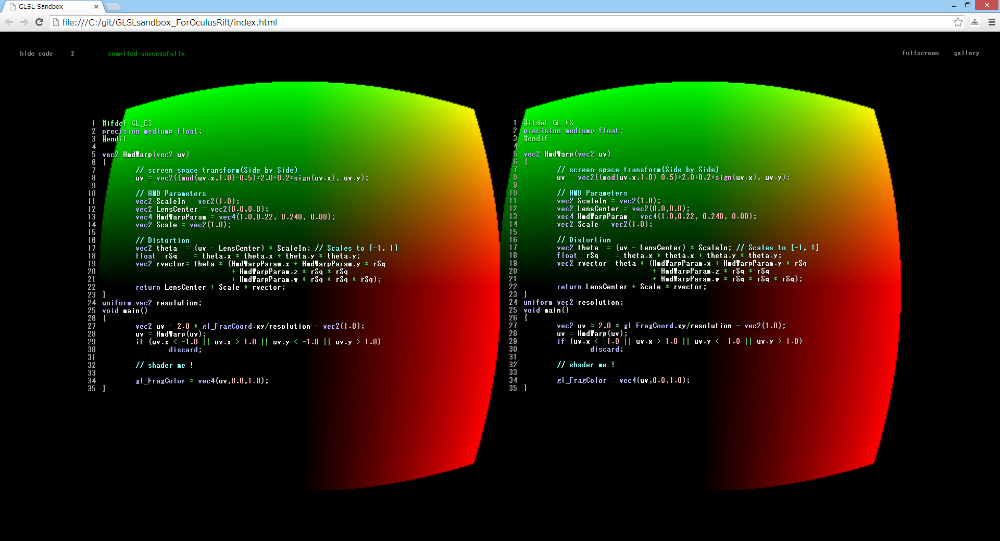

# GLSL shader sandbox for Oculus rift

## What is this?

WebGL based GLSL editor for Oculus Rift.

Presentation at Tokyo Demo Fest 2014 <http://tokyodemofest.jp/2014/>

## based on GLSL sandbox
  https://github.com/mrdoob/glsl-sandbox

## Usage
0. connect Oculus Rift!

1. start up oculus bridge
(repository including App)

    * mac: oculus-bridge-osx.zip
    * win: oculus-bridge-win.zip

    SEE ALSO: https://github.com/Instrument/oculus-bridge

2. open index.html
(tested on Chrome)

3. write GLSL the right pain.
(the left pain is read only)

## LICENSE
MIT License.
